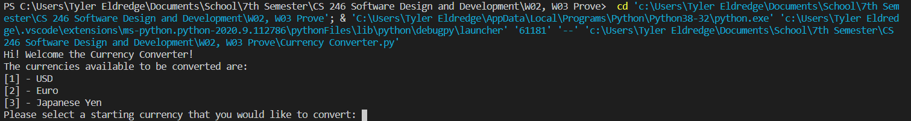

# Overview
My first Currency Converter program using Python.

# Development Environment

* Visual Studio Code
* Python 3.8.5

# Execution

To execute the Currency Converter program: `python Currency_converter.py`

# Useful Websites

* [Python Refrence](https://docs.python.org/3/library/index.html)
